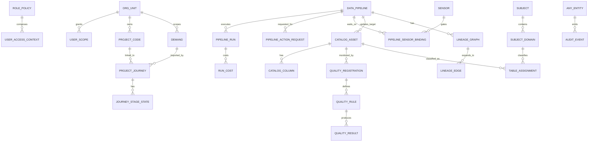
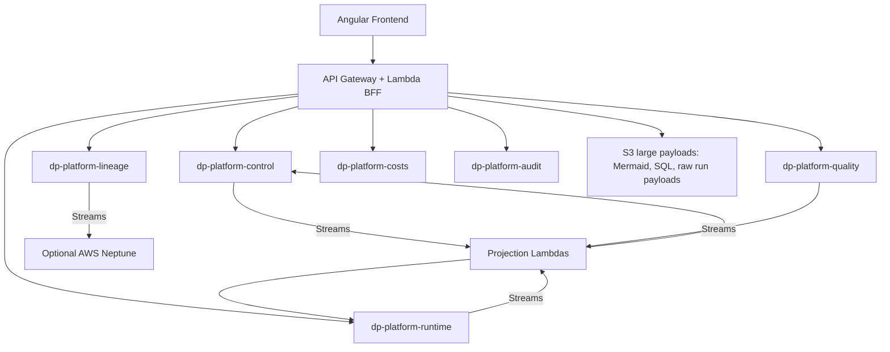

# Backend data model for the Data Platform Webapp

Status: proposed architecture
Target stack: AWS Lambda + Amazon DynamoDB
Last reviewed: 2026-05-04

## Executive decision

Mermaid makes sense, but not alone.

For this platform, the best deliverable is a versioned architecture document with four layers:

1. Conceptual domain model in Mermaid.
2. Access pattern matrix by screen and backend capability.
3. DynamoDB physical design with tables, PK/SK, GSIs, item types and examples.
4. Evolution rules: schema versioning, audit, projections, TTL and migrations.

Reason: DynamoDB is query-first. A classic ERD is useful to align language, but the real design quality is in access patterns, item collections, partition keys, sparse indexes and lifecycle separation.

## DynamoDB principles used

- Model from access patterns first, not from normalized relational entities.
- Keep strongly related low-volume control-plane entities in a single-table design.
- Separate high-volume/time-series workloads into their own tables because they have different retention, throughput and query patterns.
- Use immutable event/audit tables for traceability.
- Use optimistic concurrency with `version` and conditional writes.
- Add `schemaVersion` to every item.
- Prefer additive field evolution; do not rename fields in-place without a compatibility window.
- Use sparse GSIs only where a screen or Lambda flow needs them.
- Use DynamoDB Streams + Lambda for derived projections and aggregates.
- Store large Mermaid diagrams, SQL payloads or raw execution payloads in S3 when they approach operational size limits; keep an S3 pointer in DynamoDB.

Useful AWS references:

- DynamoDB data modeling: https://docs.aws.amazon.com/amazondynamodb/latest/developerguide/data-modeling.html
- Best practices for DynamoDB: https://docs.aws.amazon.com/amazondynamodb/latest/developerguide/best-practices.html
- Secondary indexes: https://docs.aws.amazon.com/amazondynamodb/latest/developerguide/SecondaryIndexes.html
- TTL: https://docs.aws.amazon.com/amazondynamodb/latest/developerguide/TTL.html
- Transactions: https://docs.aws.amazon.com/amazondynamodb/latest/developerguide/transactions.html

## Scope covered by the current frontend

Screens and capabilities covered:

- Developer home
- New project journey
- My projects
- Demands
- Project code registry
- Data pipeline registry
- Manual pipeline action requests
- Catalog assets
- Lineage and lineage metrics
- Data quality overview, table detail and metadata
- Orchestrator readiness, self healing, sensors and bindings
- Ops health board
- Daily progress
- Alerts
- Execution costs
- Executive KPIs
- Capacity and SLAs
- Term abbreviation utility
- Admin access policies
- Admin organization tree
- Admin subjects/domains
- Admin stage catalog
- Admin audit

## Domain overview



## DynamoDB table topology



## Table 1: `dp-platform-control`

Purpose: low/medium-volume control-plane data and CRUD-heavy metadata.

Why one table: these entities are strongly connected, read mostly by scope, and need transactional updates across metadata records. This keeps Lambda reads cheap and reduces joins.

Primary key:

| Key | Type | Description |
| --- | --- | --- |
| `PK` | string | Item collection partition |
| `SK` | string | Item sort key |

Common attributes:

| Attribute | Required | Notes |
| --- | --- | --- |
| `entityType` | yes | Example: `PIPELINE`, `CATALOG_ASSET`, `DEMAND` |
| `id` | yes | Stable ULID or canonical natural id |
| `schemaVersion` | yes | Integer, starts at 1 |
| `status` | when applicable | Active, inactive, deleted, completed, etc. |
| `createdAt` | yes | ISO-8601 UTC |
| `createdBy` | yes | User principal |
| `updatedAt` | yes | ISO-8601 UTC |
| `updatedBy` | yes | User principal |
| `version` | yes | Incremented by conditional writes |
| `scope` | when applicable | `{ level, id }` |
| `ttl` | no | Only for ephemeral control items |

Indexes:

| Index | PK | SK | Purpose |
| --- | --- | --- | --- |
| `GSI1` | `GSI1PK` | `GSI1SK` | Lists by entity/status/scope |
| `GSI2` | `GSI2PK` | `GSI2SK` | Lookup by canonical name or code |
| `GSI3` | `GSI3PK` | `GSI3SK` | Lists by squad/gerencia/sigla |
| `GSI4` | `GSI4PK` | `GSI4SK` | Inverted relations: asset-to-pipeline, pipeline-to-asset |

### Item types in `dp-platform-control`

#### Access and organization

| Entity | PK | SK | Main GSIs |
| --- | --- | --- | --- |
| Role policy | `ROLE#<role>` | `POLICY` | `GSI1PK=ENTITY#ROLE_POLICY` |
| Screen capability | `SCREEN#<screenId>` | `CAPABILITY#<capability>` | `GSI1PK=ENTITY#SCREEN_CAPABILITY` |
| Org unit | `ORG#<unitId>` | `META` | `GSI1PK=ENTITY#ORG_UNIT#LEVEL#<level>` |
| Org child edge | `ORG#<parentId>` | `CHILD#<childId>` | `GSI2PK=ORG_CHILD#<childId>` |
| User access override | `USER#<userId>` | `ACCESS_OVERRIDE#<id>` | `GSI1PK=ENTITY#USER_ACCESS_OVERRIDE` |

Notes:

- Authentication groups should continue to come from IAM Identity Center, Entra ID, Cognito or another IdP.
- Store platform-specific overrides only when needed.
- Admin policy edits must be audited and versioned.

#### Demands, project codes and journeys

| Entity | PK | SK | Main GSIs |
| --- | --- | --- | --- |
| Demand | `DEMAND#<demandId>` | `META` | `GSI1PK=SCOPE#<scopeId>#DEMAND`, `GSI2PK=DEMAND_CODE#<code>` |
| Project code | `PROJECT_CODE#<code>` | `META` | `GSI1PK=SCOPE#<squadId>#PROJECT_CODE`, `GSI2PK=PROJECT_CODE#<code>` |
| Project journey | `JOURNEY#<journeyId>` | `META` | `GSI1PK=SCOPE#<squadId>#JOURNEY#STATUS#<status>` |
| Journey stage state | `JOURNEY#<journeyId>` | `STAGE#<stageId>` | `GSI1PK=JOURNEY_STAGE#STATUS#<status>` |
| Journey-to-demand link | `DEMAND#<demandId>` | `JOURNEY#<journeyId>` | `GSI4PK=JOURNEY#<journeyId>` |
| Journey-to-project-code link | `PROJECT_CODE#<code>` | `JOURNEY#<journeyId>` | `GSI4PK=JOURNEY#<journeyId>` |
| Stage catalog config | `STAGE#<stageId>` | `META` | `GSI1PK=ENTITY#STAGE_CONFIG` |

Design rules:

- Journey template is immutable after creation.
- Deletion is logical: `status=deleted`, `deletedAt`, `deletedBy`.
- Stage output can be embedded when small. Large stage output goes to S3.
- Use `version` conditional writes when saving stage state.

Example project journey item:

```json
{
  "PK": "JOURNEY#01HV...",
  "SK": "META",
  "entityType": "PROJECT_JOURNEY",
  "id": "01HV...",
  "schemaVersion": 1,
  "templateId": "glue-pyspark",
  "name": "customer_360",
  "status": "active",
  "projectCodes": ["ED2741"],
  "importedDemandId": "demand-2741",
  "targetTable": "spec.customer_360",
  "squadId": "squad-b",
  "currentStage": "Infra de sandbox Glue",
  "progress": 38,
  "GSI1PK": "SCOPE#squad-b#JOURNEY#STATUS#active",
  "GSI1SK": "UPDATED#2026-05-04T09:00:00Z#JOURNEY#01HV...",
  "version": 7
}
```

#### Pipeline registry and manual actions

| Entity | PK | SK | Main GSIs |
| --- | --- | --- | --- |
| Data pipeline | `PIPELINE#<pipelineId>` | `META` | `GSI1PK=ENTITY#PIPELINE#STATUS#<status>`, `GSI3PK=SIGLA#<sigla>` |
| Pipeline source relation | `PIPELINE#<pipelineId>` | `SOURCE#<sourceQualifiedName>` | `GSI4PK=ASSET#<sourceQualifiedName>` |
| Pipeline target relation | `PIPELINE#<pipelineId>` | `TARGET#<targetQualifiedName>` | `GSI4PK=ASSET#<targetQualifiedName>` |
| Pipeline action request | `PIPELINE#<pipelineId>` | `ACTION_REQUEST#<requestId>` | `GSI1PK=ENTITY#PIPELINE_ACTION#STATUS#<status>` |

Design rules:

- `registrationSource` means discovered/manual registry entry. It is not the same as manually executed.
- Manual CRUD requires techlead/manager capabilities.
- Keep `sources` and `target` denormalized in `META` for list screens, but also write relation items for reverse lookups.
- Action payloads may contain large JSON. Store small payload inline; large payload in S3 with `payloadS3Uri`.

#### Catalog, subjects and terms

| Entity | PK | SK | Main GSIs |
| --- | --- | --- | --- |
| Catalog asset | `ASSET#<qualifiedName>` | `META` | `GSI1PK=ENTITY#ASSET#LAYER#<layer>`, `GSI2PK=ASSET_NAME#<qualifiedName>` |
| Catalog column | `ASSET#<qualifiedName>` | `COLUMN#<columnName>` | `GSI1PK=ENTITY#COLUMN#ASSET#<qualifiedName>` |
| Subject | `SUBJECT#<subjectId>` | `META` | `GSI1PK=ENTITY#SUBJECT` |
| Subject domain | `SUBJECT#<subjectId>` | `DOMAIN#<domainId>` | `GSI2PK=DOMAIN#<domainId>` |
| Table assignment | `ASSET#<qualifiedName>` | `ASSIGNMENT#SUBJECT_DOMAIN` | `GSI4PK=DOMAIN#<domainId>` |
| Term abbreviation | `TERM#<normalizedTerm>` | `ABBREVIATION` | `GSI1PK=ENTITY#TERM_ABBREVIATION` |

Design rules:

- Immutable fields for assets: `sigla`, `qualifiedName`, `database`, `tableName`, `layer`.
- Editable fields: `goldenSource`, `domain`, `supportSquad`, `sla`, `description`, `tags`, `classification`.
- Store latest known schema as column items to avoid bloated asset items.
- If full text search becomes important, use OpenSearch or a separate search projection. Do not force broad text search into DynamoDB scans.

#### Data quality metadata

| Entity | PK | SK | Main GSIs |
| --- | --- | --- | --- |
| Quality registration | `ASSET#<qualifiedName>` | `QUALITY_REGISTRATION` | `GSI1PK=ENTITY#QUALITY_REGISTRATION#STATUS#<status>` |
| Quality rule | `ASSET#<qualifiedName>` | `QUALITY_RULE#<ruleId>` | `GSI2PK=QUALITY_RULE#<ruleType>#STATUS#<status>` |
| Quality rule template | `QUALITY_TEMPLATE#<templateId>` | `META` | `GSI1PK=ENTITY#QUALITY_TEMPLATE#DATA_TYPE#<type>` |

Design rules:

- Metadata is in control table.
- Runtime results belong in `dp-platform-quality`.
- Rules must support generic qualitative, generic quantitative and custom rules.
- Keep rule expressions versioned. Changing a rule creates a new version or increments `ruleVersion`.

#### Orchestrator metadata

| Entity | PK | SK | Main GSIs |
| --- | --- | --- | --- |
| Sensor | `SENSOR#<sensorId>` | `META` | `GSI1PK=ENTITY#SENSOR#ENABLED#<enabled>` |
| Sensor query fingerprint | `SENSOR_QUERY#<queryHash>` | `META` | none |
| Pipeline sensor binding | `PIPELINE#<pipelineId>` | `SENSOR_BINDING` | `GSI4PK=SENSOR#<sensorId>` |
| Pipeline sensor binding edge | `SENSOR#<sensorId>` | `PIPELINE#<pipelineId>` | `GSI4PK=PIPELINE#<pipelineId>` |

Design rules:

- Sensor query hash prevents duplicate SQL.
- One sensor can gate many pipelines.
- A pipeline can have many sensors.
- Target criticality comes from the pipeline target asset, not source tables.

#### Lineage metadata

| Entity | PK | SK | Main GSIs |
| --- | --- | --- | --- |
| Lineage graph manifest | `LINEAGE_GRAPH#<graphId>` | `META` | `GSI1PK=ENTITY#LINEAGE_GRAPH#SOURCE#<manual|automatic>` |
| Pipeline lineage pointer | `PIPELINE#<pipelineId>` | `LINEAGE_GRAPH#<graphId>` | `GSI4PK=LINEAGE_GRAPH#<graphId>` |
| Entity lineage pointer | `LINEAGE_ENTITY#<entityType>#<entityName>` | `GRAPH#<graphId>` | `GSI4PK=LINEAGE_GRAPH#<graphId>` |

Design rules:

- Manual lineage has priority over automatic lineage.
- Automatic ingestion must not overwrite manual lineage; it can create a candidate version.
- Mermaid text can be stored inline if small; otherwise store in S3.
- If AWS Neptune is adopted, DynamoDB stores lineage metadata and submission workflow; Neptune stores graph traversal state.

## Table 2: `dp-platform-runtime`

Purpose: operational snapshots, job runs, sensor states, alerts and daily progress.

Primary key:

| Key | Type | Description |
| --- | --- | --- |
| `PK` | string | Runtime partition |
| `SK` | string | Time or entity sort |

Indexes:

| Index | PK | SK | Purpose |
| --- | --- | --- | --- |
| `GSI1` | `GSI1PK` | `GSI1SK` | Lookup by status/day/squad |
| `GSI2` | `GSI2PK` | `GSI2SK` | Lookup by pipeline/job |
| `GSI3` | `GSI3PK` | `GSI3SK` | Active alerts by severity |

Item types:

| Entity | PK | SK | Notes |
| --- | --- | --- | --- |
| Operational snapshot | `OPS_SNAPSHOT#<yyyy-mm-dd>` | `META#<snapshotAt>` | Freshness marker for ops screens |
| Job expected schedule | `JOB#<jobName>` | `SCHEDULE#<yyyy-mm-dd>` | Expected run for the day |
| Job run | `JOB#<jobName>` | `RUN#<runStartAt>#<runId>` | Runtime execution |
| Sensor state | `SENSOR#<sensorId>` | `STATE#<checkedAt>` | Last query result history |
| Pipeline readiness projection | `READINESS#<yyyy-mm-dd>` | `PIPELINE#<pipelineId>` | Job-level readiness row |
| Monitoring alert | `ALERT#<alertId>` | `META` | Active/acknowledged/resolved |
| Daily progress bucket | `DAILY_PROGRESS#<yyyy-mm-dd>` | `HOUR#<hh>` | Optional materialized curve |

Retention:

- Raw sensor states: 30-90 days in DynamoDB, then export to S3 if needed.
- Job runs: 90-180 days in DynamoDB for UI, archive to S3 for long retention.
- Active alerts have no TTL until resolved; resolved alerts can TTL after retention policy.

Example readiness projection:

```json
{
  "PK": "READINESS#2026-05-04",
  "SK": "PIPELINE#pipeline-2",
  "entityType": "PIPELINE_READINESS",
  "pipelineId": "pipeline-2",
  "pipelineName": "transform_customer_360",
  "targetQualifiedName": "spec.customer_360",
  "targetCriticality": "altissima",
  "sigla": "eg4",
  "jobType": "CDP",
  "approvedQueries": 4,
  "totalQueries": 5,
  "readiness": "failed",
  "lastCheckedAt": "2026-05-04T10:24:00Z",
  "GSI1PK": "READINESS#2026-05-04#STATUS#failed",
  "GSI1SK": "CRIT#altissima#PIPELINE#pipeline-2"
}
```

## Table 3: `dp-platform-quality`

Purpose: quality execution results, score trends and field-level details.

Primary key:

| Key | Type | Description |
| --- | --- | --- |
| `PK` | string | Dataset/day partition |
| `SK` | string | Result sort key |

Indexes:

| Index | PK | SK | Purpose |
| --- | --- | --- | --- |
| `GSI1` | `GSI1PK` | `GSI1SK` | Quality by date/status/domain |
| `GSI2` | `GSI2PK` | `GSI2SK` | Quality by asset |
| `GSI3` | `GSI3PK` | `GSI3SK` | Failing rule lookup |

Item types:

| Entity | PK | SK | Notes |
| --- | --- | --- | --- |
| Table quality summary | `QUALITY#<yyyy-mm-dd>` | `ASSET#<qualifiedName>` | Score, approved, SLA breaches |
| Table quality trend | `ASSET#<qualifiedName>` | `QUALITY_DAY#<yyyy-mm-dd>` | Last N days chart |
| Field quality result | `ASSET#<qualifiedName>#DAY#<yyyy-mm-dd>` | `FIELD#<fieldName>#RULE#<ruleId>` | Field-level metrics |
| Rule execution result | `RULE#<ruleId>` | `RUN#<runAt>#<runId>` | Historical result |

Design rules:

- Metadata rules stay in `dp-platform-control`.
- Results stay here for separate retention and throughput.
- Store metric dimensions explicitly: `metricType`, `dataType`, `fieldName`, `score`, `threshold`, `actualValue`.
- For the table detail screen, query `ASSET#...` last 5 `QUALITY_DAY` items and then fetch field results for selected day.

## Table 4: `dp-platform-lineage`

Purpose: graph edges and lineage versions for UI and optional Neptune sync.

Primary key:

| Key | Type | Description |
| --- | --- | --- |
| `PK` | string | Graph/entity partition |
| `SK` | string | Edge/version sort |

Indexes:

| Index | PK | SK | Purpose |
| --- | --- | --- | --- |
| `GSI1` | `GSI1PK` | `GSI1SK` | Jobs missing lineage / coverage metrics |
| `GSI2` | `GSI2PK` | `GSI2SK` | Entity upstream/downstream |

Item types:

| Entity | PK | SK | Notes |
| --- | --- | --- | --- |
| Lineage graph version | `GRAPH#<graphId>` | `VERSION#<version>` | Manual/automatic, active/candidate |
| Lineage edge | `GRAPH#<graphId>` | `EDGE#<from>#<to>` | Direct edge |
| Entity edge out | `ENTITY#<from>` | `OUT#<to>#GRAPH#<graphId>` | Downstream lookup |
| Entity edge in | `ENTITY#<to>` | `IN#<from>#GRAPH#<graphId>` | Upstream lookup |
| Pipeline lineage coverage | `LINEAGE_COVERAGE#<yyyy-mm-dd>` | `PIPELINE#<pipelineId>` | Metrics screen |

Manual lineage priority:

- Manual graph active version wins over automatic graph active version.
- Automatic load writes `candidate` if manual active exists.
- A user with lineage permission can compare and promote.

Neptune option:

- DynamoDB remains system of record for graph submissions, ownership, approval, priority and audit.
- Neptune stores query-optimized graph traversal.
- DynamoDB Streams can publish edge changes to Neptune writer Lambda.

## Table 5: `dp-platform-costs`

Purpose: job-run-level execution costs only.

Primary key:

| Key | Type | Description |
| --- | --- | --- |
| `PK` | string | Pipeline/job partition |
| `SK` | string | Run/cost sort |

Indexes:

| Index | PK | SK | Purpose |
| --- | --- | --- | --- |
| `GSI1` | `GSI1PK` | `GSI1SK` | Costs by day/sigla/squad |
| `GSI2` | `GSI2PK` | `GSI2SK` | Lookup by job run |

Item types:

| Entity | PK | SK | Notes |
| --- | --- | --- | --- |
| Run cost | `PIPELINE#<pipelineId>` | `RUN_COST#<runStartAt>#<runId>` | Discriminated cost |
| Cost unavailable marker | `PIPELINE#<pipelineId>` | `RUN_COST_UNAVAILABLE#<runId>` | UI shows no discriminated cost |
| Daily cost aggregate | `COST#<yyyy-mm-dd>` | `SIGLA#<sigla>#PIPELINE#<pipelineId>` | Optional projection |

Design rules:

- Do not store global cloud cost here.
- Only pipeline/job-run discriminated cost belongs here.
- Manual pipeline registry entries may have no cost.

## Table 6: `dp-platform-audit`

Purpose: append-only audit trail.

Primary key:

| Key | Type | Description |
| --- | --- | --- |
| `PK` | string | Audited resource or actor |
| `SK` | string | Time/event id |

Indexes:

| Index | PK | SK | Purpose |
| --- | --- | --- | --- |
| `GSI1` | `GSI1PK` | `GSI1SK` | Audit by actor/time |
| `GSI2` | `GSI2PK` | `GSI2SK` | Audit by action/time |
| `GSI3` | `GSI3PK` | `GSI3SK` | Audit by scope/time |

Item types:

| Entity | PK | SK | Notes |
| --- | --- | --- | --- |
| Audit event | `RESOURCE#<resourceType>#<resourceId>` | `TS#<timestamp>#EVENT#<eventId>` | Immutable |
| Actor event copy | optional duplicated item | optional | Only if actor queries become hot |

Design rules:

- Never update audit events.
- Use KMS encryption and least-privilege IAM.
- Retention target in frontend says 5 years. For cost, keep recent audit in DynamoDB and export/archive older data to S3/Glacier if required.

## Access pattern matrix

| Screen/API | Query pattern | Table/index |
| --- | --- | --- |
| Sidebar capability rendering | Get role policies/capabilities for user roles | `dp-platform-control` role items |
| Admin policies | List/update role policies | `dp-platform-control`, `ROLE#<role>` |
| Admin org | Tree by parent, lookup children | `dp-platform-control`, org child items |
| Admin subjects/domains | List subjects/domains and table assignments | `dp-platform-control` |
| Admin stage catalog | List/update stage configs | `dp-platform-control`, `GSI1 ENTITY#STAGE_CONFIG` |
| Admin audit | List latest audit by resource/actor/action | `dp-platform-audit` GSIs |
| Demands | List demands by scope/status/search token | `dp-platform-control`, `GSI1`; OpenSearch optional |
| Project journey | Get journey meta + stages + links | `dp-platform-control`, `PK=JOURNEY#...` |
| My projects | List journeys by squad/status; completed by owner | `dp-platform-control`, `GSI1/GSI3` |
| Project code registry | CRUD project code by squad/code | `dp-platform-control` |
| Pipeline registry | List pipelines by access/sigla/status; CRUD manual | `dp-platform-control`, `GSI1/GSI3` |
| Pipeline detail | Get pipeline meta, sources, targets | `dp-platform-control`, `PK=PIPELINE#...` |
| Pipeline action | Create request and list recent requests | `dp-platform-control` |
| Catalog list | List assets by layer/sigla/golden/domain/criticality | `dp-platform-control`, `GSI1/GSI3` |
| Catalog detail | Get asset, columns, upstream direct pipelines | `dp-platform-control`, asset PK + `GSI4` |
| Quality today | Read quality summaries by day | `dp-platform-quality`, `PK=QUALITY#date` |
| Quality table detail | Last 5 scores + field results | `dp-platform-quality`, `PK=ASSET#...` and day partition |
| Quality metadata | Registrations and rules by asset/status | `dp-platform-control` |
| Lineage metrics | Coverage by day/sigla/domain | `dp-platform-lineage`, `GSI1` |
| Manual lineage | Create graph manifest + edges | `dp-platform-control` + `dp-platform-lineage` transaction/workflow |
| Orchestrator readiness | Job rows by day/status/filter | `dp-platform-runtime`, readiness projection |
| Sensors CRUD | Sensor list/create/update/toggle | `dp-platform-control` |
| Pipeline-sensor bindings | Get/update pipeline binding | `dp-platform-control` |
| Self healing | Jobs monitored today + query states | `dp-platform-runtime` projection |
| Ops overview | Job schedule/run status by day/squad | `dp-platform-runtime` |
| Daily progress | Daily job runs + expected finish history | `dp-platform-runtime` |
| Alerts | Active/acknowledged alerts | `dp-platform-runtime`, `GSI3` |
| Costs | Run cost by pipeline/run/date | `dp-platform-costs` |
| Executive overview | Scope aggregates | projections in `runtime`, `quality`, `costs` |
| Term abbreviations | Lookup normalized term | `dp-platform-control`, `TERM#...` |

## API/Lambda boundaries

Recommended Lambda modules:

| Lambda/API module | Owns |
| --- | --- |
| `access-api` | Role policy, effective capabilities, screen access |
| `org-api` | Org units and scopes |
| `project-api` | Demands, project codes, journeys, stage states |
| `pipeline-api` | Pipeline registry and manual action requests |
| `catalog-api` | Assets, columns, subjects, domains, terms |
| `quality-api` | Quality metadata and quality result reads |
| `orchestrator-api` | Sensors, bindings, readiness projections |
| `ops-api` | Job health, daily progress, alerts |
| `lineage-api` | Graph manifests, Mermaid validation, edge versions |
| `cost-api` | Job-run-level costs |
| `audit-api` | Audit reads; writes should be library/side effect |

Each write Lambda should:

1. Validate authorization against effective capabilities.
2. Validate item schema.
3. Use condition expressions for optimistic concurrency.
4. Write business item and audit event.
5. Emit stream event for projections.

## Evolution strategy

Every item gets:

```json
{
  "schemaVersion": 1,
  "version": 3,
  "createdAt": "2026-05-04T00:00:00Z",
  "createdBy": "user@company.com",
  "updatedAt": "2026-05-04T01:00:00Z",
  "updatedBy": "user@company.com"
}
```

Rules:

- Add fields as optional first.
- Backfill with async Lambda only when a new access pattern requires indexed values.
- Never remove fields until all Lambdas and frontend versions stop reading them.
- For renamed fields, write both old and new for one compatibility window.
- For breaking shape changes, increment `schemaVersion` and add a read adapter.
- Use `version` with conditional writes: update only if current version matches.
- Keep write APIs idempotent with `idempotencyKey` for action requests and imports.

## Validation and integrity rules

Important invariants:

- A pipeline target criticality belongs to target table/asset, never source table.
- A pipeline created from one journey template cannot change template.
- Deleted journeys remain queryable with deletion metadata.
- Manual lineage has priority over automatic lineage.
- Sensor SQL cannot be duplicated after normalization/hash.
- Pipeline registry CRUD is restricted to techlead/manager/admin capabilities.
- Sustentation mode must not access project-only sections.
- Cost screens must never imply total cloud cost; only discriminated run cost.
- All CRUD writes produce audit events.

## Capacity and hot partition notes

Potential hot spots and mitigations:

- `READINESS#<date>` can become hot if thousands of jobs refresh together. If needed, shard by hour or squad: `READINESS#<date>#SQUAD#<squadId>`.
- `QUALITY#<date>` can become hot for all tables. If needed, partition by domain/sigla: `QUALITY#<date>#SIGLA#<sigla>`.
- Audit by actor can become hot for automation users. Prefer resource-primary writes and sparse actor projection only where needed.
- Term lookup is low volume and safe.
- Catalog asset lookup by `qualifiedName` is stable and safe.

## Security and compliance

- DynamoDB tables encrypted with AWS-owned or customer-managed KMS key according to company policy.
- Fine-grained IAM per Lambda module.
- No broad scan permission in runtime Lambdas.
- Write APIs validate `scope` server-side; never trust frontend mode/persona.
- CloudWatch structured logs must avoid sensitive payloads.
- S3 payload objects use bucket policies and object tags aligned to entity scope.
- Audit table has deletion protection path; destructive operations should be logical.

## Why not a pure relational/star schema now?

The app is currently an operational platform, not an analytical warehouse.

- DynamoDB is appropriate for CRUD, screen projections, workflow state, audit and runtime snapshots.
- Star schema will still be useful later for analytics/history in Athena/Redshift/Snowflake.
- Recommended future: export DynamoDB streams/snapshots to S3 and model facts/dimensions separately for BI.

Future analytical facts:

- `fact_pipeline_run`
- `fact_quality_result`
- `fact_sensor_check`
- `fact_cost_run`
- `fact_user_action`
- `dim_pipeline`
- `dim_catalog_asset`
- `dim_org_unit`
- `dim_date`
- `dim_user`

## Three review passes applied

### Review 1: frontend coverage

Checked every current major frontend area and mapped it to at least one backend entity and access pattern:

- Projects/journeys/demands
- Data pipeline registry/actions
- Catalog/quality/lineage
- Orchestrator/ops/alerts/costs
- Admin/access/org/audit/stages
- Executive dashboards
- Utilities

Result: no major screen is left without a backend owner.

### Review 2: DynamoDB correctness

Rechecked the model against DynamoDB constraints:

- Query-first design.
- No dependency on joins.
- No generic scans for main screens.
- Separate tables for different throughput/retention profiles.
- Sparse GSIs only for concrete access patterns.
- Hot partitions called out with mitigation.

Result: model is suitable for Lambda + DynamoDB and can scale without immediate redesign.

### Review 3: evolution and maintainability

Rechecked long-term evolution:

- `schemaVersion` and read adapters.
- Additive changes first.
- Conditional writes with `version`.
- Immutable audit.
- Manual lineage priority.
- Optional Neptune integration without replacing DynamoDB as workflow system of record.
- S3 offload for large payloads.

Result: model supports future fields, schema changes and new screens with controlled migrations.

